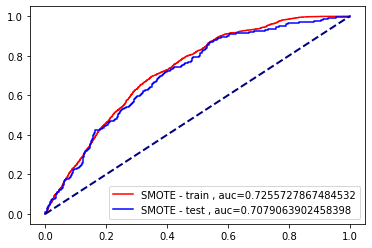

# Campaign Response Model

<a href="./Campaign%20Response%20Model.ipynb">Jupyter Notebook</a>

### Imbalanced data was fix with smote 
### Logistic Regression is then done to train the model with accuracy over 70% which is not bad, could be better using XGBoost and improving the feature selection process

